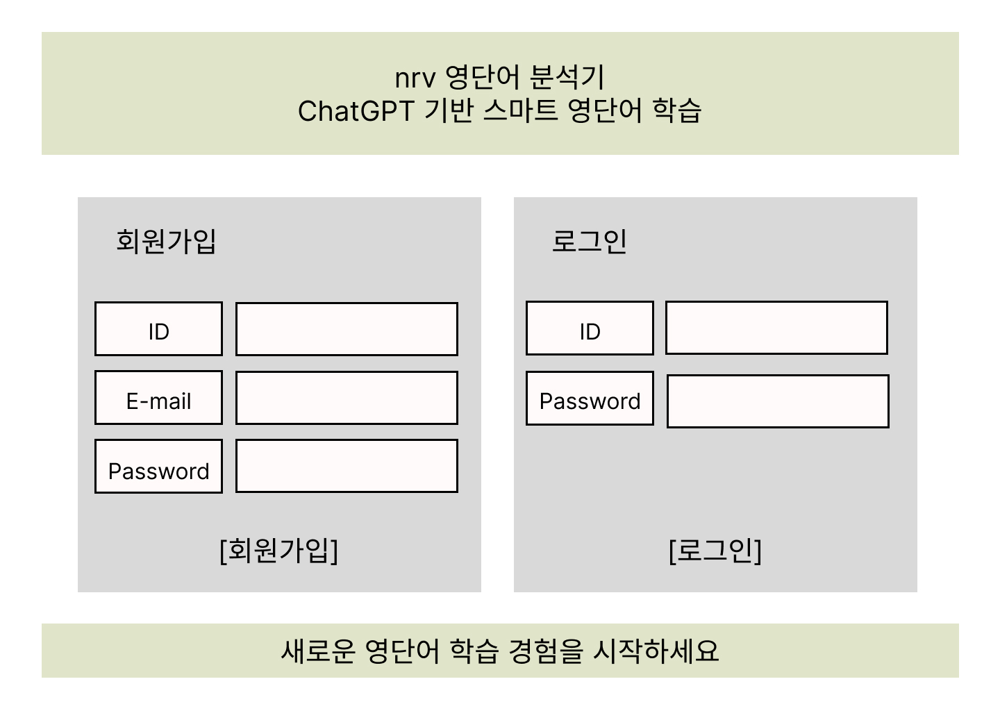
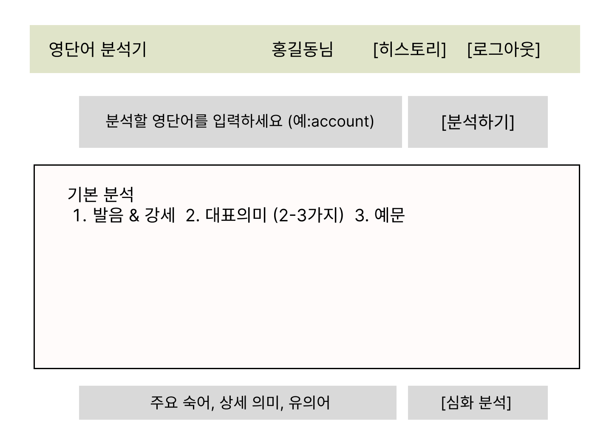
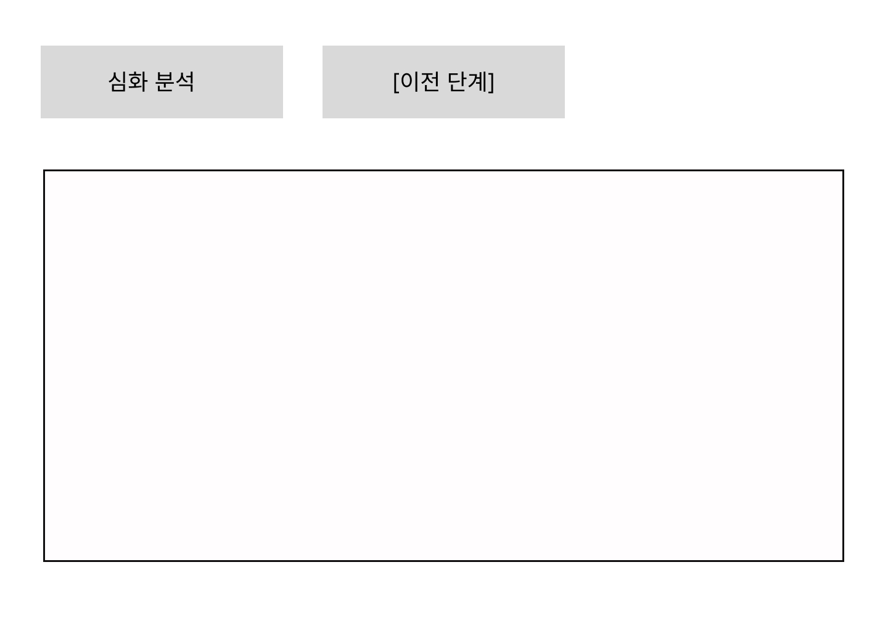
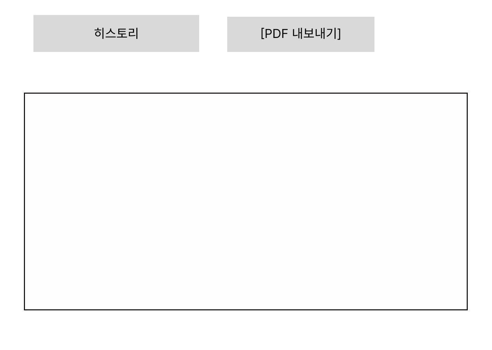

# 🚀 ChatGPT 기반 영단어 분석기

---

## 📋 프로젝트 설명
ChatGPT API를 활용해 영어 단어를 기본과 심화의 두 단계로 분석하는 단어 학습 웹 애플리케이션입니다.

---

## 🌟 **주요 기능**

#### **1차 기본 분석**
- **발음 정보**: IPA 발음기호 + 한국어 발음 + 강세 표시
- **대표 의미**: 핵심 의미 2-3가지 제공
- **예문 & 번역**: 3개 예문 + 한국어 번역 + 맥락별 의미

#### **2차 심화 분석**
- **주요 숙어**: 실용적인 숙어 1-2개
- **상세 의미**: 어원 및 의미 확장 과정
- **유의어**: 3개 유의어

#### **학습 기록 관리**
- 대화내용 확인
 

---

## 🎨 **와이어프레임 & 화면 설계**

### **1. 로그인/회원가입 화면**


### **2. 기본 분석 화면**
  

### **3. 심화 분석 화면**


### **4. 히스토리 화면**


---

### 💻 **기술 스택**
```
🔧 Backend:  FastAPI, Python, uvicorn
🎨 Frontend: HTML5, CSS3, JavaScript
🤖 AI:       ChatGPT API (부트캠프 서버)
💾 Storage:  메모리 기반 세션 관리
📱 Design:   반응형 웹 디자인
```


## 📁 **프로젝트 구조**

```
📦 영단어분석기/
├── 🐍 main.py                    # FastAPI 메인 서버
├── 📂 templates/                 # HTML 템플릿
│   ├── 🔐 index.html            # 로그인/회원가입
│   ├── 📝 chat.html             # 기본 분석 화면
│   ├── 🔍 advanced_chat.html    # 심화 분석 화면
│   └── 📚 history.html          # 히스토리 화면
├── 📂 static/                    # 정적 파일
│   ├── 🎨 style.css             # 통합 스타일시트
│   ├── 🔑 auth.js               # 인증 로직
│   ├── 💬 chat.js               # 기본 분석 로직
│   ├── 🔬 advanced.js           # 심화 분석 로직
│   └── 📖 history.js            # 히스토리 로직
├── 📂 images/                    # 📸 와이어프레임 이미지
│   ├── wireframe_login.jpg      # 로그인 화면 와이어프레임
│   ├── wireframe_chat.jpg       # 기본분석 화면 와이어프레임
│   ├── wireframe_advanced.jpg   # 심화분석 화면 와이어프레임
│   └── wireframe_history.jpg    # 히스토리 화면 와이어프레임
├── 📋 README.md                  # 📚 프로젝트 문서
└── 📋 chatbot_wbs.md            # 프로젝트 WBS 문서
```

---

## 🎯 **핵심 구현 사항**

### **API 엔드포인트**

| Method | Endpoint | 설명 |
|--------|----------|------|
| `GET` | `/` | 로그인/회원가입 화면 |
| `POST` | `/api/register` | 회원가입 처리 |
| `POST` | `/api/login` | 로그인 처리 |
| `POST` | `/api/analyze-basic` | 기본 영단어 분석 |
| `POST` | `/api/analyze-advanced` | 심화 영단어 분석 |
| `GET` | `/api/chat-history` | 사용자 히스토리 조회 |

### 입력 검증
- 아이디 중복 체크 및 3자 이상 입력 필수
- 비밀번호 4자 이상 입력 필수  
- 이메일 형식 검증 (@ 포함)
- 단어 검색창에 영어 단어만 입력 가능

### 사용 제한
- 영어 단어 입력 없이는 분석 기능 사용 불가

### 기능 동작
- 중복 검색 단어 발생 시 최근 검색 기록만 히스토리에 유지
- 단어 검색 시간 순서대로 히스토리 구성
- PDF 내보내기 기능 제공
---


## 🛠️ **실행 방법**

### 1️⃣ **환경 설정**
```bash
# Python 가상환경 생성
python -m venv venv
venv\Scripts\activate # Mac: source venv/bin/activate  

# 의존성 설치
pip install fastapi uvicorn httpx
```

### 2️⃣ **서버 실행**
```bash
uvicorn main:app --reload
```

### 3️⃣ **접속**
```
🌐 메인 화면:     http://localhost:8000
📚 API 문서:      http://localhost:8000/docs
```

---


